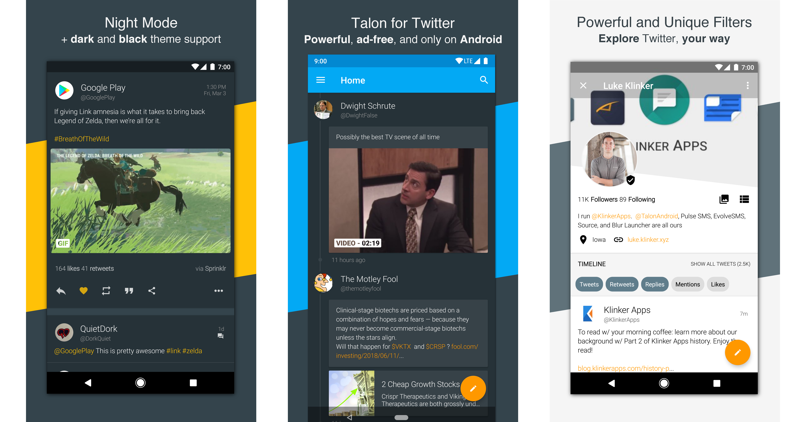

# Talon for Twitter



This is the complete version of the Twitter client that I created for Android. It is 100% open source, the only thing that you will have to do plug in is your own API keys.

I am lucky enough to say that, as a paid app, Talon has perched itself at the top of the **top paid social apps** list since it's release in 2014. It has amassed 100,000+ downloads while holding a 4.6 star rating on the Play Store. This app is one of the more successful apps I have ever made and I am open sourcing it as a "thank you" to everyone that has supported my work over the years! It works great and I'm proud to say that it can probably be considered one of the most popular third party Twitter apps.

While I will be the first to admit that it is very far from perfect - and a lot of the base code was written when I had no clue what I was doing - it it could be a very cool project to look at for inspiration, implementation details, and contributions.

Enjoy Talon for Twitter and let me know what you want to see next!

### Building Talon

Before Talon will work, you will need to generate some API keys, for Twitter. I will not be distributing my keys.

To get your Twitter API key, go through these steps:

1. sign in on their developer site (https://apps.twitter.com/)
2. Click `Create New App`.
3. Choose a name, description, and website. These are all required and unique to your app, but it makes no difference what you call them. Anything will work here.
4. For the callback URL, you can do anything you like, but to have it work out of the box, use: `http://talonfortwitter.com`
  * If you want a different one (stressing that it really DOES NOT matter..) then change it in the `LoginFragment`
5. Read and accept their `Rules of the Road`, then `Create your Twitter Application`
6. After it is created, you can change the icon and add some other info from the settings page.
7. You NEED to go to the `Permissions` page of the app and select the `Read, Write and Access direct messages` option, or else you won't be able to do anything but view your timeline.

##### Adding API Keys to the App

In the `.gitignore` file, I have ignored `secrets.properties` which should contain your keys. Go ahead, copy the `secrets.properties.sample` to `secrets.properties` and fill in the keys in it.

This allows me to keep the keys out of source control, but still build the app without any hassle.

There are fields for the Twitter keys, as well as some third party services that Talon utilizes. You do not have to generate keys for the third party services. Those services just will not work.

##### Providing a Signing Configuration

For release builds, add your keystore simply as `keystore` to the root of the project, then add a `keystore.properties` file to the root with (no quotation marks around these strings!):

```
KEY_SIGNATURE=xxxx
KEY_ALIAS=xxxx
```

## Contributing


Please fork this repository and contribute back using [pull requests](https://github.com/klinker24/talon-twitter-material/pulls). Features can be requested using [issues](https://github.com/klinker24/talon-twitter-material/issues). All code, comments, and critiques are greatly appreciated.


---

## License

    Copyright 2018 Luke Klinker

    Licensed under the Apache License, Version 2.0 (the "License");
    you may not use this file except in compliance with the License.
    You may obtain a copy of the License at

       http://www.apache.org/licenses/LICENSE-2.0

    Unless required by applicable law or agreed to in writing, software
    distributed under the License is distributed on an "AS IS" BASIS,
    WITHOUT WARRANTIES OR CONDITIONS OF ANY KIND, either express or implied.
    See the License for the specific language governing permissions and
    limitations under the License.
